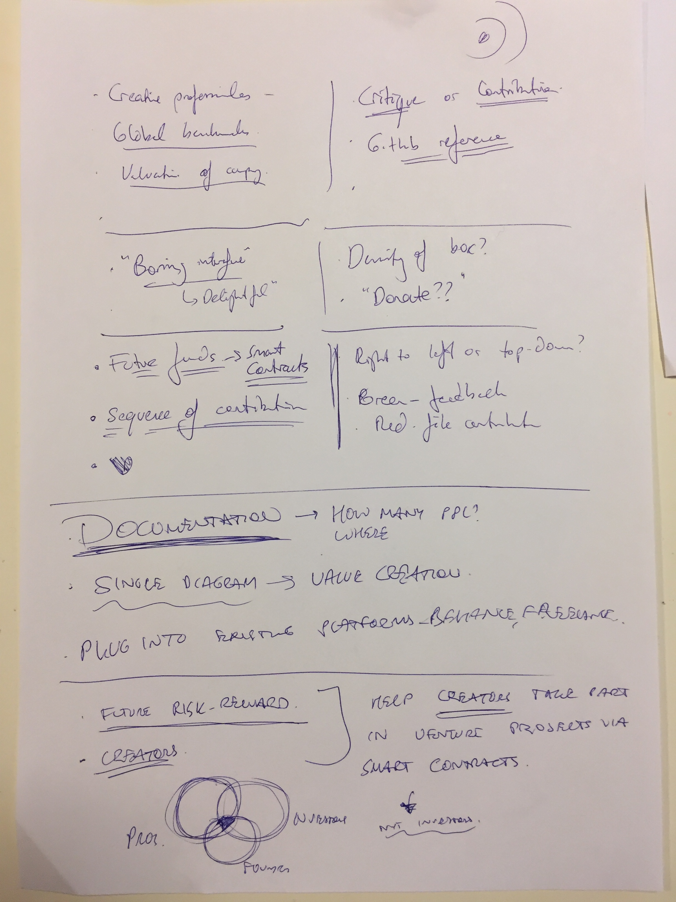
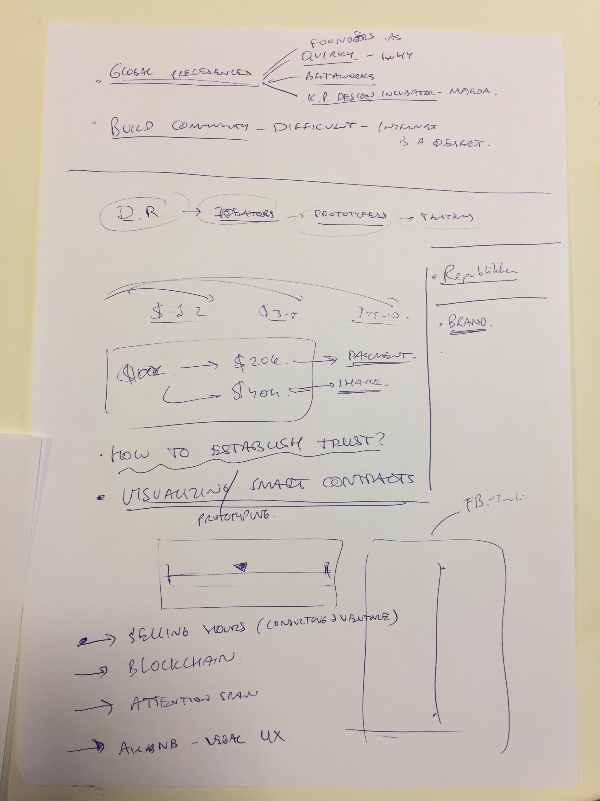
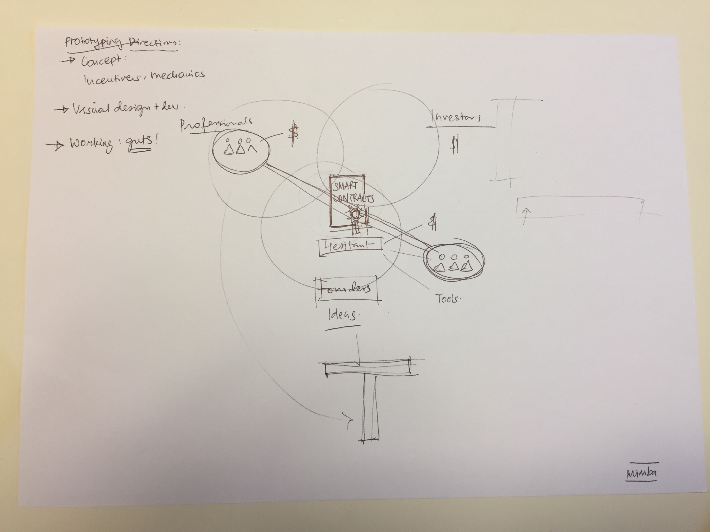

# Review 2

Start with one group, and know them really well, and then bring the others.

This is **a platform to help creators take part in venture projects via smart contracts.**

The core insight is around the creators, or at least the relationship between founders and creators. The investors are peripheral. 

Blockchain is a great opportunity, it is an uncharted territory. A lot of people still don't know how to apply that technology to different industries. Starting with that as a narrative would make it stronger; otherwise, I'd already have the competition of other similar platforms.

The whole system fails, if the professionals are not good.

Closed system may not be the way to go, because in our day and age, the value one can capture by opening things up is massive.

You don't always have to promise payment, you can also promise shares. 

In my presentation, I really need to prove that I have solid personas, which start with professionals. If this fails, everything else fails.

Think of different ways and mechanics I could setup relationships between the parties.

Freelance work is becoming commodity. When you commoditise the work, how do you handle the quality and risk-taking? Maybe it's those, whop take risks that become more famed designers?

Take a look at current systems to build confidence:

- Betaworks
- Founders.as (here in Cph)
- Quirky - failed, would give shares to people who contribute. I have to really prove that I understood the mechanics of that failure. Engin's thesis: they've been converging to the average; the problems they were solving were too mediocre. 
- K. P. Design Incubator (by J. Maeda) - failed.

UI:

- Hard to understand the time (no left-to-right)
- Shouldn't feel engineering-like
- Horizontal is the normalised timeline; vertical - detailed timeline, which should be familiar (Facebook, etc., build on that).
- Timeline should also indicate "where are we at the process"
- Investors: if they just see good output and solid team, it's fine. They have short attention span.
- Contributions/critiques - strong/weak link?
- Investors want to see the credentials of the team (sometimes more than just the idea itself)
- Dashboard: the team, hours committed, the output.

Don't make another project management tool. The documentation problem is harder to solve.

I don't want to see how much work is done. I want to feel inspired, I want to see this person and see this idea, and understand if it has legs; THEN I want to know how much time, effort, money has got put into it. But essentially: who are working? Whom would I have access to? Then, I'll think if they need my type of skills.

2 interfaces: what the professionals see is completely different from what the founders see. Don't try to merge them.

Start with a professional, move towards founder.

Take photos. Every meeting you go to, take photos with whom I'm talking to. That will build confidence that these are real people I've talked to. In presentations, it shows the depth of design research. **It's a litmus test.**

The most people who will come to the exhibition live in the context of my project. Hear something new, or frame something we all know in a way that we never thought about it. That should be the underlying hook upon which my concept is built. Individually, the audience understands these problems really well.

Prototype a smart contract. Find a small task, find a startup, find a creator, and say "I'm gonna be the smart contract".

Visualising a smart contract is another great UI challenge, because Blockchain is mystical to people.

3 directions of prototyping:

- Concept: incentives, mechanics. How does the system actually work, where do people take part in it, why would they be convinced about it?
- Visual design. Why are we representing the information this way, what information needs to be shared with whom?
- Blood and guts: how does it feel to live in it, how does it feel to sign a smart contract for 5k euros? Example case: people asking for help are really bad at asking for help.

Simulate through artefacts, different scenarios (like in service design).

Don't prototype all of the parts. Choose 1 or 2 for in-detail research, but design all three parts.

What are the numbers that are acceptable for people: Elance as reference.

Try a physical workspace. 

Do your project to yourself.

If it's only 1-2 days of work, code blockchain and show it.

Name the baby, it's already born! Promise into the future, trust: mythology, philosophy.

